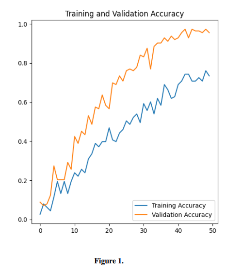
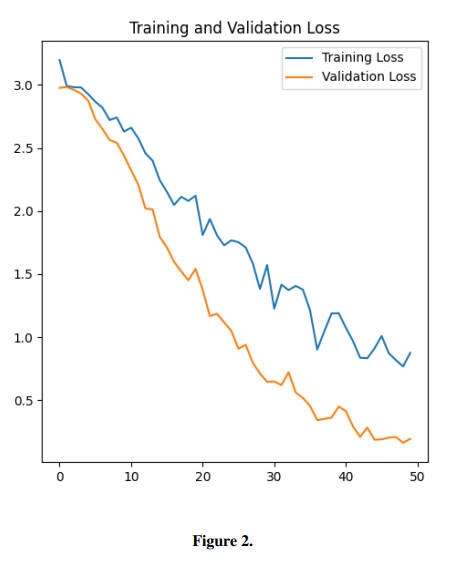
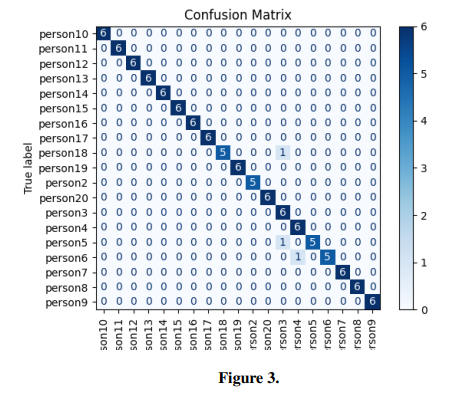

# Facial Recognition System — CNN-Based Face Classification

A Convolutional Neural Network (CNN) based facial recognition system developed to investigate the effectiveness of deep learning for multi-class facial image classification.

The project was developed as part of an academic study on the use of Artificial Intelligence in facial recognition and biometric authentication systems. It explores CNN-based feature learning, image preprocessing, data augmentation, model training, and performance evaluation.

## Overview

Facial recognition systems use machine learning and computer vision techniques to identify or verify individuals based on facial characteristics.

This project implements a custom CNN that learns visual features directly from facial images and classifies them into different identity classes.

The study also considers practical challenges associated with facial recognition, including:

* Dataset limitations and bias
* Variations in lighting and pose
* Occlusion and image quality
* Model generalisation
* Privacy and security
* Real-world deployment constraints

## Objectives

The main objectives of the project were to:

* Develop a CNN-based facial recognition model.
* Preprocess and normalise facial images.
* Apply data augmentation to improve model generalisation.
* Train the model for multi-class facial classification.
* Evaluate performance using multiple classification metrics.
* Analyse model errors using a confusion matrix.
* Investigate the limitations of facial recognition systems.
* Consider ethical, privacy, and security implications.

## Dataset

A subset of the **VGGFace2** dataset was used for the experimental evaluation.

The dataset was organised into multiple identity classes and divided into training and validation sets.

For preprocessing:

* Images were resized to **128 × 128 pixels**.
* Pixel values were normalised to the range **0–1**.
* Training images were augmented using rotation, zoom, shear, and horizontal flipping.

The original facial image dataset is **not included in this repository** because of dataset size, privacy, and licensing considerations.

## Model Architecture

The system uses a custom convolutional neural network consisting of three convolutional blocks followed by fully connected layers.

### Architecture

| Layer      | Configuration            |
| ---------- | ------------------------ |
| Input      | 128 × 128 × 3            |
| Conv2D     | 32 filters, 3 × 3, ReLU  |
| MaxPooling | 2 × 2                    |
| Conv2D     | 64 filters, 3 × 3, ReLU  |
| MaxPooling | 2 × 2                    |
| Conv2D     | 128 filters, 3 × 3, ReLU |
| MaxPooling | 2 × 2                    |
| Flatten    | —                        |
| Dense      | 128 neurons, ReLU        |
| Dropout    | 0.5                      |
| Output     | Softmax                  |

The convolutional layers learn increasingly complex visual features, while dropout is used to reduce the risk of overfitting.

## Training

The model was trained using:

* **Optimizer:** Adam
* **Loss function:** Categorical Cross-Entropy
* **Batch size:** 32
* **Maximum epochs:** 50 in the current implementation
* **Early stopping:** Enabled
* **Input resolution:** 128 × 128 pixels

Early stopping was used to restore the best model weights based on validation loss.

## Results

The model achieved a peak validation accuracy of approximately **97%** during the experiment.

### Classification Performance

The classification report produced the following overall results:

| Metric             | Score |
| ------------------ | ----: |
| Accuracy           |  0.97 |
| Macro Precision    |  0.98 |
| Macro Recall       |  0.97 |
| Macro F1-score     |  0.97 |
| Weighted Precision |  0.98 |
| Weighted Recall    |  0.97 |
| Weighted F1-score  |  0.97 |

Most identity classes achieved strong precision, recall, and F1-scores.

Some classes showed slightly lower recall, with misclassifications potentially associated with limited training samples, occlusion, pose variation, or similarities between facial features.

## Evaluation

Several evaluation methods were used to assess the model.

### Accuracy and Loss Curves

The training history was analysed using accuracy and loss curves to monitor learning behaviour and identify potential overfitting.





### Confusion Matrix

A confusion matrix was generated to examine the distribution of correct and incorrect predictions across the identity classes.



### Classification Report

Precision, recall, and F1-score were calculated for each identity class.

The results showed that the majority of classes were classified correctly, while a small number experienced reduced recall.

## Key Findings

The experiment demonstrated that a relatively compact CNN can achieve strong classification performance on a controlled facial image dataset.

The main findings were:

1. The CNN achieved approximately **97% validation accuracy**.
2. Most identity classes achieved high precision and recall.
3. The model demonstrated good generalisation within the experimental dataset.
4. Some classes were more difficult to classify than others.
5. Dataset size and diversity remain important limitations.
6. High accuracy on a controlled dataset does not necessarily guarantee reliable real-world facial recognition.

## Limitations

Despite the strong experimental results, several limitations should be considered.

### Dataset Size

The experimental dataset was relatively small, with **20 identity classes** and a limited number of evaluation images.

A larger and more diverse dataset would provide a stronger basis for evaluating real-world performance.

### Environmental Conditions

The model was not extensively tested under real-world conditions such as:

* Poor lighting
* Extreme facial poses
* Motion blur
* Significant occlusion
* Different camera qualities

### Generalisation

The reported 97% accuracy reflects performance on the experimental dataset and should not be interpreted as equivalent to real-world facial recognition accuracy.

### Bias and Fairness

Facial recognition systems can be affected by demographic and dataset bias. Training data should therefore contain sufficient diversity to reduce unequal performance across different groups.

### Security

A production biometric authentication system would require additional protection against attacks such as presentation attacks, photographs, masks, and synthetic or deepfake-generated faces.

## Ethical and Privacy Considerations

Facial recognition involves highly sensitive biometric information.

Potential concerns include:

* Unauthorised identification
* Mass surveillance
* Collection of biometric data without consent
* Data breaches
* Demographic performance disparities
* Misuse of facial recognition technology

For real-world deployment, privacy-preserving approaches, secure storage, consent mechanisms, and appropriate governance would be essential.

## Future Work

Potential improvements include:

* Expanding the dataset with greater demographic and environmental diversity.
* Testing the system with larger datasets.
* Exploring embedding-based approaches such as FaceNet.
* Evaluating transfer learning using architectures such as ResNet.
* Testing the model using live video.
* Implementing face detection before classification.
* Investigating liveness detection and anti-spoofing techniques.
* Exploring privacy-preserving machine learning.
* Optimising the model for edge devices.

## Technologies

* Python
* TensorFlow
* Keras
* NumPy
* Scikit-learn
* Matplotlib
* Convolutional Neural Networks
* Computer Vision
* Deep Learning

## Project Structure

```text
facial-recognition-system/
│
├── README.md
├── requirements.txt
├── .gitignore
│
├── src/
│   └── facial_recognition.py
│
└── images/
    ├── accuracy_curve.png
    ├── loss_curve.png
    └── confusion_matrix.png
```

## Running the Project

### 1. Clone the repository

```bash
git clone https://github.com/YOUR-USERNAME/facial-recognition-system.git
cd facial-recognition-system
```

### 2. Create a virtual environment

```bash
python -m venv venv
```

Activate it on Windows:

```bash
venv\Scripts\activate
```

### 3. Install dependencies

```bash
pip install -r requirements.txt
```

### 4. Add the dataset

Because the original dataset is not included in the repository, place the locally available dataset in the appropriate data directory.

The code should use relative paths rather than machine-specific paths such as:

```text
C:/Users/wcnna/PycharmProjects/...
```

For example:

```text
data/
├── train/
└── validation/
```

### 5. Run the model

```bash
python src/facial_recognition.py
```

## Academic Context

This project formed part of an academic study titled:

**"The Use of AI in Facial Recognition and Biometric Authentication Systems"**

The study investigated CNN-based facial recognition alongside broader topics including biometric authentication, dataset bias, privacy, security, and future developments in AI-based biometric systems.

## References

* Cao, Q., Shen, L., Xie, W., Parkhi, O. M., & Zisserman, A. (2018). *VGGFace2: A dataset for recognising faces across pose and age*. International Journal of Computer Vision.
* Buolamwini, J., & Gebru, T. (2018). *Gender Shades: Intersectional Accuracy Disparities in Commercial Gender Classification*. Proceedings of FAT*.
* Schroff, F., Kalenichenko, D., & Philbin, J. (2015). *FaceNet: A Unified Embedding for Face Recognition and Clustering*. CVPR.
* He, K., Zhang, X., Ren, S., & Sun, J. (2016). *Deep Residual Learning for Image Recognition*. CVPR.
* Jain, A. K., Ross, A., & Nandakumar, K. (2011). *Introduction to Biometrics*. Springer.
* Simonyan, K., & Zisserman, A. (2014). *Very Deep Convolutional Networks for Large-Scale Image Recognition*. arXiv.

## Author

**Wesley Nnanyere**

Software Engineer
